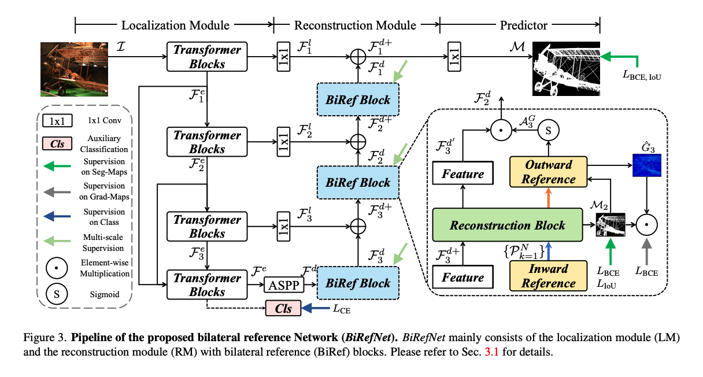
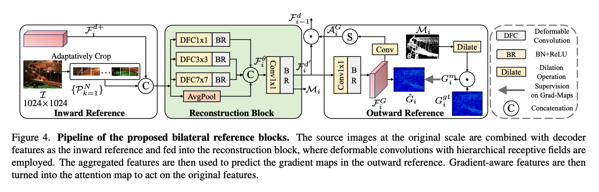

## TL;DR

1. BiRefNet 논문을 1회 읽어 보았다.
1. 읽기도 벅찼다.
1. 다음에 읽을게 많다.

## BiRefNet
### 정보
- 논문 제목: Bilateral Reference for High-Resolution Dichotomous Image Segmentation
- 저자: Peng Zheng, Dehong Gao, Deng-Ping Fan, Li Liu, Jorma Laaksonen, Wanli Ouyang, Nicu Sebe
- 링크: https://arxiv.org/pdf/2401.03407

### 목적
- 고해상도 이진 이미지 분할(DIS, Dichotomous Image Segmentation)
- 기존 모델([1], [2], [3], [4], [5])는 배경과 비슷한 경계 등을 잘 분리하지 못하는 한계가 있었음

### 핵심 아이디어
분리된 localization module과 reconsturction module을 사용해 높은 해상도의 이미지 DIS를 진행한다.

### 구조

### Localization Module
- 위치를 지정하기 위한 semeantic representation 얻기
    - N x 3 x H x W shape를 가진 이미지 input을 사용
    - 단계 별로 resolution을 $\{\frac{H}{k}, \frac{W}{k}\}(k = 4, 8, 16, 32)$로 만들어 feature를 끄집어 내고, 1x1 컨볼루션 레이어를 통한 측면 연결을 디코더로 넣는다.
    - 마지막 인코더 블록에서 stack & concatenate 되고 결합되어 encoder로 들어간다.
    - encoder output은 classification module로 입력되어 global average pooling layer와 fully connected layer를 거쳐 카테고리에 대한 분류를 수행한다.
    - 큰 객체의 특징을 포괄할 수 있도록 receptive fields를 확장하고 높은 정밀 도를 위해 local feature에 집중하도록 ASPP 모듈을 이용해서 multi-context fusion을 진행한다.    

### Reconstruction Module
- 이미지 재조립
    1. BiRef 블록 안에 Reconstruction Block(RB) 도입 => 다양한 스케일의 특징을 균형 있게 추출
    1. 계층적 수용 영역의 Deformable Convolution + Adaptive Average Pooling 적용 => 다양한 RF를 통한 특징 포착
    1. 추출된 RF를 concat해서 하나의 텐서로 병합
    1. 1x1 convolution 및 Batch Normalization으로 RB 출력 생성
    1. BiRef 블록으로 전송 => coarse-to-fine 방식 디코딩 시작
    1. Lateral Feture와 합성
    1. Multi-stage supoervision 수행 (중간 예측 loss)
    1. decoder 출력
### Bilateral Reference

- Bliateral reference 제안
    - 배경
        - DIS에서 HR 이미지의 경우, 기존 연구를 따라 encoder-decorder 구조를 이미지 down-sampling 후 up-sampling하는 경우가 많았음
        - 이미지 크기가 커서 특정 오브젝트에 집중하는게 어려움
    - 구조
        - inward reference(InRef): HR information 보완
            - 이미지를 특정 사이즈로 잘라 patch를 만들어 decoder feature들과 합침
            - original feature에 합쳐 쌓아서 RM에 넣음
            - 모든 stage에서 수행
        - outward reference(OutRef): dense detail로 집중 영역 그리기
            - gradient label을 사용해 segmentaion을 잘할 수 있게 함.
            - 단계
                1. input image의 gradient map 생성 ($G_i^{gt}$)
                2. 동시에 gradient map $\hat{G}_i$을 예측하도록 $F_i^\theta$를 이용해서 $F_i^G$로 만듦 => $F_i^G$가 gredient sensitive 해짐
                3. conv 와 sigmoid laye를 통과하고 gredient referring attention $A_i^G$를 만듦
                4. 이는 $F_i^{d^`}$과 곱해져 BiRef block의 output을 만듦 ($F_{i-1}^d$)
            - non-target noise 처리
                - non-target noise를 줄이기 위해 intermediate predictions($M_i$)를 morphological operation을 하고, 이를 확장해 마스크로 사용
                - $G_i^{gt}$에 곱해져 mask area 밖의 영역을 제외한 gradients map($G_i^m$)이 생성됨
### Objective Function
BCE만 사용하면 오히려 디테일을 잡는데 악영향을 주기에 hybrid loss를 사용
- BCE(Binary Cross-Entropy): pixel-aware supervision
- IoU(Intersection Over Union): region-aware supervision
- SSIM(Structural Similarity Index Measure): boundary-aware supervision
- CE(Cross-Entropy): sementic-aware supervision

## 느낀점
### 제대로 이해하기 위해서는 학습을 많이 해야 한다.
- 솔직히 한번 읽고 이해가 안가서 chatGPT의 도움을 많이 받았습니다. 무력감을 느낄 정도로 머리가 아팠어요. 실험 부터는 그냥 읽기만 한 거 같네요.
- 일단 개념 익히고 2회독, 3회독 하면서 필요한 개념을 좀 많이 숙지하고 참고 논문들 찾아가 봐야 겠네요.

## 할거 목록
### 개념 익히기
- convolusion
- encoder, decoder
- morphological operation
- intermediate prediction
- gredient의 효과
- stack, concat, squeeze
- loss function
- receptive fields
- average pooling layer
- ASPP
- fusion 

### 다회독 하기
- 이 논문

[1]: https://arxiv.org/abs/2111.14482 (High Quality Segmentation for Ultra High-resolution Images)
[2]: https://ieeexplore.ieee.org/document/4767837 (A Pyramid-Based Approach to Segmentation Applied to Region Matching)
[3]: https://arxiv.org/abs/1704.08545 (ICNet for Real-Time Semantic Segmentation on High-Resolution Images)
[4]: https://arxiv.org/abs/2209.09475 (Revisiting Image Pyramid Structure for High Resolution Salient Object Detection)
[5]: https://www.ijcai.org/proceedings/2023/0124.pdf (Locate, Refine and Restore: A Progressive Enhancement Network for Camouflaged Object Detection)